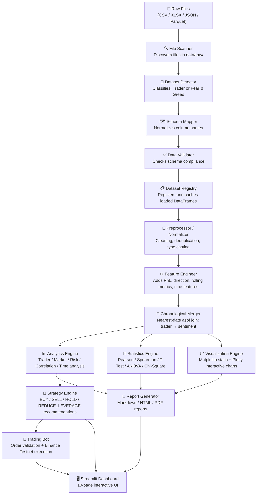
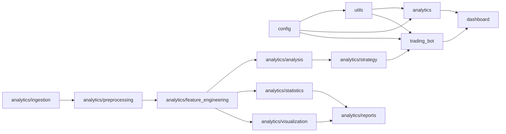
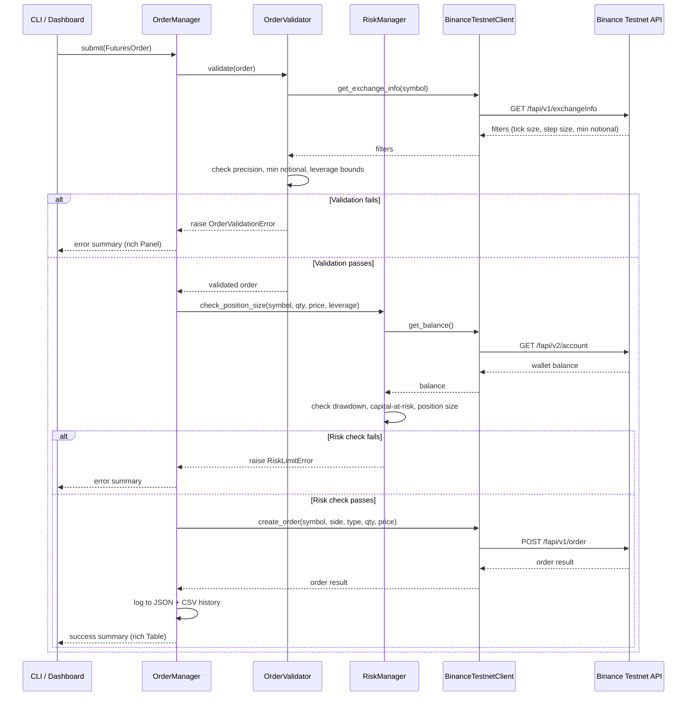
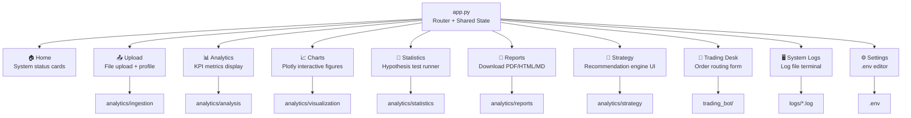

# PrimeTrade AI — Architecture Reference

> Version 1.0.0 | Production Release

This document describes the complete system architecture of PrimeTrade AI — a sentiment-driven cryptocurrency analytics suite and Binance Futures Testnet trading bot.

---

## 1. System Overview

PrimeTrade AI is organized into six distinct operational layers. Each layer has a clearly defined responsibility with no cross-layer coupling:

```
┌─────────────────────────────────────────────────────────────────────┐
│                        Presentation Layer                           │
│          Streamlit Dashboard  •  Typer CLI                          │
├─────────────────────────────────────────────────────────────────────┤
│                       Execution Layer                               │
│     Binance Testnet Client  •  Order Manager  •  Risk Manager       │
├─────────────────────────────────────────────────────────────────────┤
│                      Strategy Layer                                 │
│       Rule-Based Strategy Engine  •  Recommendation Exporter        │
├─────────────────────────────────────────────────────────────────────┤
│                      Analytics Layer                                │
│  Analytics Engine  •  Statistics Engine  •  Visualization Engine    │
│               Report Generator                                      │
├─────────────────────────────────────────────────────────────────────┤
│                    Data Processing Layer                            │
│  Feature Engineer  •  Preprocessor  •  Normalizer  •  Merger        │
├─────────────────────────────────────────────────────────────────────┤
│                      Ingestion Layer                                │
│   File Scanner  •  Dataset Detector  •  Schema Mapper  •  Registry  │
└─────────────────────────────────────────────────────────────────────┘
```

---

## 2. End-to-End Data Flow



---

## 3. Module Dependency Graph



---

## 4. Trading Bot Request & Validation Lifecycle



---

## 5. Dashboard Page Dependency Map



---

## 6. Directory Structure

```
PrimeTrade-AI/
├── .github/
│   └── workflows/
│       └── ci.yml                   # 5-job CI/CD pipeline
├── analytics/
│   ├── ingestion/                   # File detection and registry
│   ├── preprocessing/               # Normalization, cleaning, merge
│   ├── feature_engineering/         # Metric and indicator generation
│   ├── analysis/                    # Behavioral and profitability metrics
│   ├── statistics/                  # Statistical significance testing
│   ├── visualization/               # Matplotlib + Plotly chart generators
│   ├── strategy/                    # Rule-based recommendation engine
│   ├── reports/                     # HTML / PDF / Markdown report compilers
│   └── outputs/                     # Generated charts, reports, and exports
├── trading_bot/
│   ├── client/                      # Binance Testnet REST client + retry
│   ├── orders/                      # Pydantic order schemas
│   ├── validators/                  # Pre-trade validation logic
│   ├── risk_manager.py              # Portfolio and position risk checks
│   ├── position_manager.py          # Active position tracking
│   ├── order_manager.py             # Orchestrator + history exporter
│   └── cli.py                       # Typer-based CLI entrypoint
├── dashboard/
│   ├── app.py                       # Streamlit multi-page router
│   ├── pages/                       # 10 individual page modules
│   ├── components/                  # Reusable UI card components
│   └── styles/                      # CSS theme and glassmorphic styles
├── config/
│   ├── settings.py                  # .env-driven system configuration
│   ├── paths.py                     # Centralized path constants
│   ├── constants.py                 # Numerical thresholds and limits
│   └── enums.py                     # Shared enumerations
├── utils/
│   ├── logger.py                    # Multi-file rotating logger
│   ├── exceptions.py                # Custom exception hierarchy
│   └── helpers.py                   # Generic helper functions
├── tests/
│   ├── conftest.py                  # Shared pytest fixtures
│   ├── integration/                 # End-to-end pipeline & bot tests
│   └── test_*.py                    # Module-level unit tests
├── docs/
│   ├── ARCHITECTURE.md              # This file
│   └── API_REFERENCE.md             # Public API documentation
├── data/
│   ├── raw/                         # Original uploaded datasets
│   ├── processed/                   # Cleaned and merged outputs
│   ├── uploads/                     # Dashboard-uploaded files
│   └── exports/                     # Order history exports
├── logs/                            # system.log, analytics.log, bot.log, errors.log
├── Dockerfile                       # Multi-stage Docker build
├── docker-compose.yml               # dashboard + analytics + bot services
├── .pre-commit-config.yaml          # Pre-commit hooks
├── pyproject.toml                   # black / isort / project metadata
├── .flake8                          # Flake8 configuration
├── pytest.ini                       # Pytest configuration
├── .coveragerc                      # Coverage configuration
├── requirements.txt                 # Python dependencies
├── .env.example                     # Environment variable template
├── main.py                          # Verification and pipeline runner
├── README.md                        # Quickstart documentation
├── RELEASE_NOTES.md                 # Release changelog
└── PROJECT_REPORT.md                # Permanent project record
```

---

## 7. Key Design Decisions

| Decision | Rationale |
|---|---|
| **Single ingestion entry point** | All downstream modules use `DatasetLoader` — no raw `pd.read_csv()` calls allowed |
| **Timezone-naive timestamps** | `pd.merge_asof` requires matching dtypes; all timestamps normalized to `datetime64[ns]` |
| **Pydantic v2 for bot schemas** | Strict field validation at the boundary catches invalid orders before any API call |
| **Dry-run mode** | All bot commands default to `DRY_RUN=true` for safe testing without API credentials |
| **Non-root Docker user** | Security best practice — container runs as `primetrade` (UID 1001) |
| **Multi-stage Docker build** | Separates build tools from runtime; reduces final image size significantly |
| **Pre-commit hooks** | Enforces code quality locally before any push, avoiding CI failures |

---

## 8. Configuration & Secrets

All credentials and environment-specific settings are controlled via `.env` (git-ignored). The `.env.example` template documents all supported variables:

| Variable | Description | Default |
|---|---|---|
| `BINANCE_API_KEY` | Binance Futures Testnet API Key | *(required)* |
| `BINANCE_SECRET_KEY` | Binance Futures Testnet Secret | *(required)* |
| `PROJECT_ENV` | `DEVELOPMENT` / `STAGING` / `PRODUCTION` | `DEVELOPMENT` |
| `LOG_LEVEL` | Logging verbosity | `INFO` |
| `DRY_RUN` | Skip live order submission | `true` |
| `DEFAULT_LEVERAGE` | Default position leverage | `10` |
| `MAX_LEVERAGE` | Hard cap on leverage | `20` |
| `MAX_DRAWDOWN_PCT` | Max allowed drawdown before halt | `15.0` |
| `MAX_CAPITAL_AT_RISK_PCT` | Max portfolio exposure | `50.0` |
| `MAX_SINGLE_TRADE_PCT` | Max single trade as % of balance | `10.0` |
